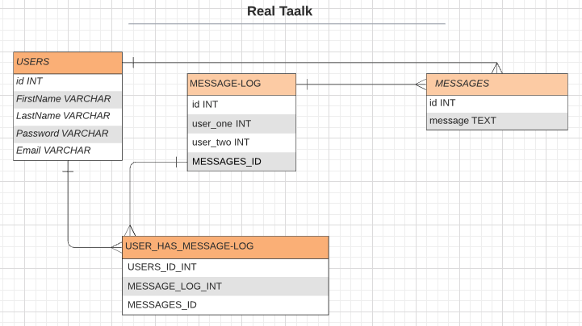
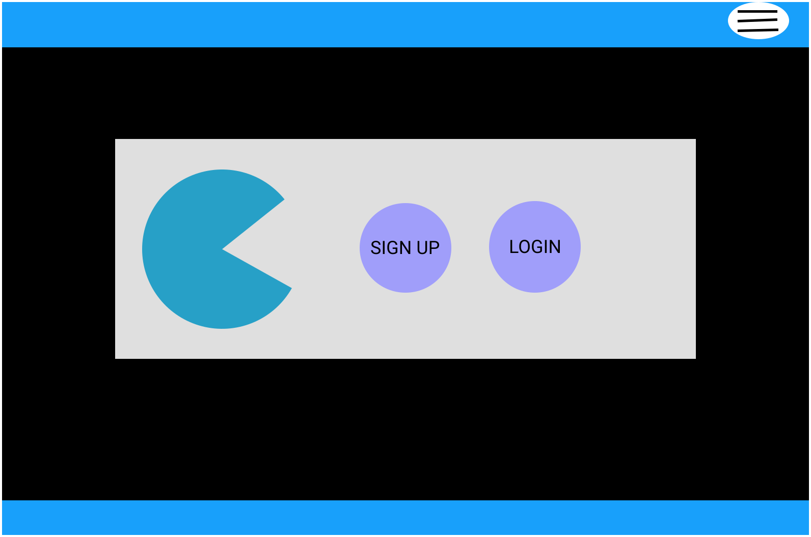
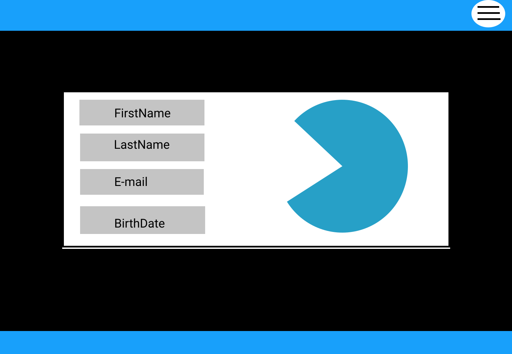
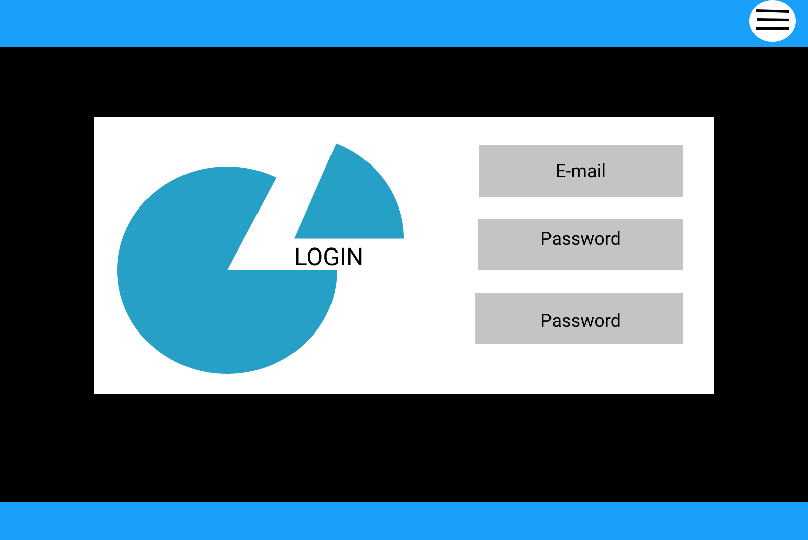
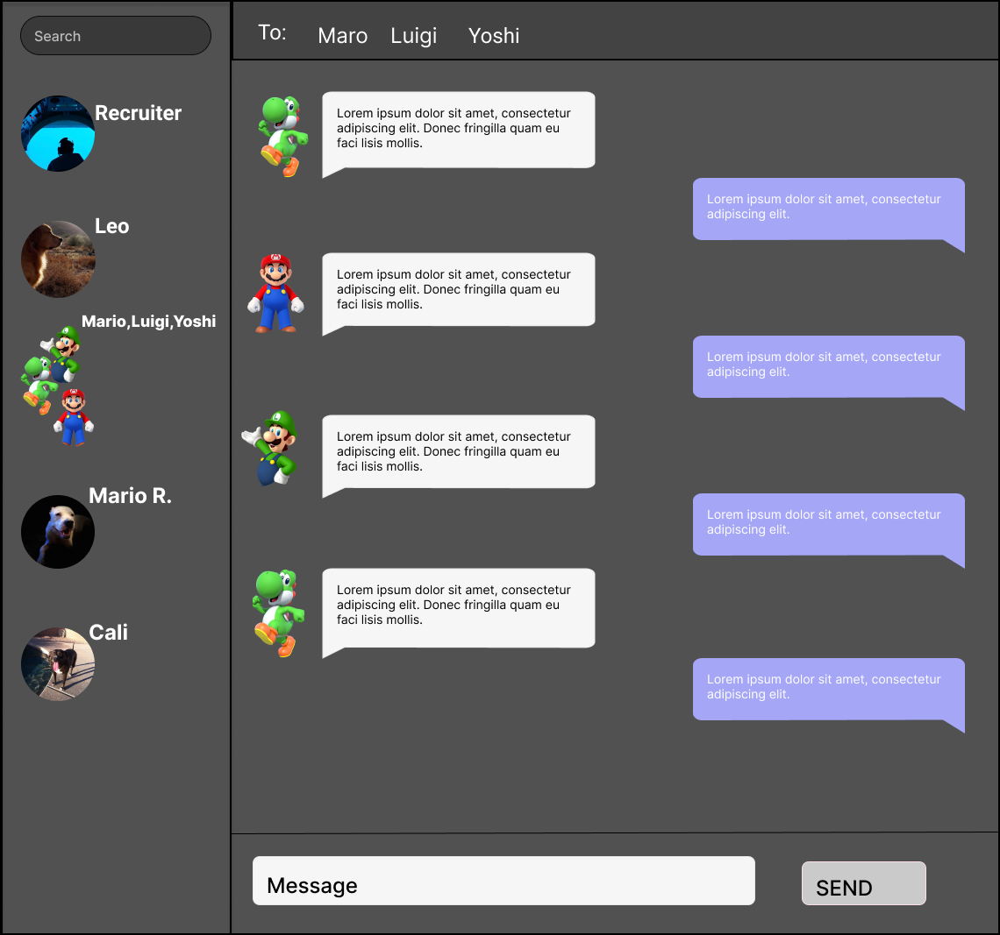

## RealTaalk

RealTaalk is a chat app allowing users to stay connected world wide.

## Motivation

Connecting users through chat rooms and understanding websockets while learning the hard parts of Node.js.

## Technologies Used

JavaScript,
PostgreSQL,
Express,
React,
Node.js,
Socket.io,
React-Bootstrap,
HTML/CSS,
Figma

##### ERD

##### Wireframes

##### Screenshots

## Future Development

Future plans will include allowing the user to save threads,send different file types and customize chat rooms.
